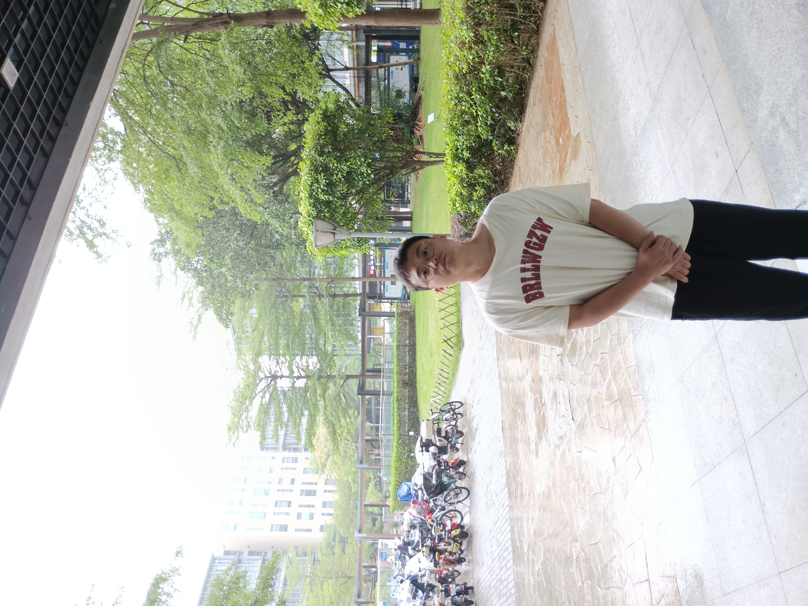
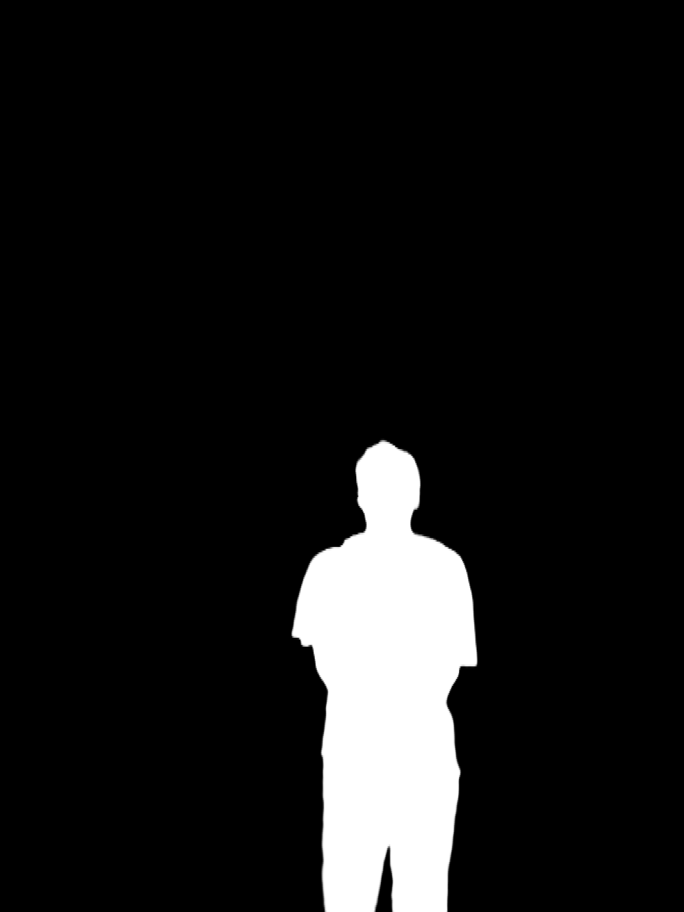
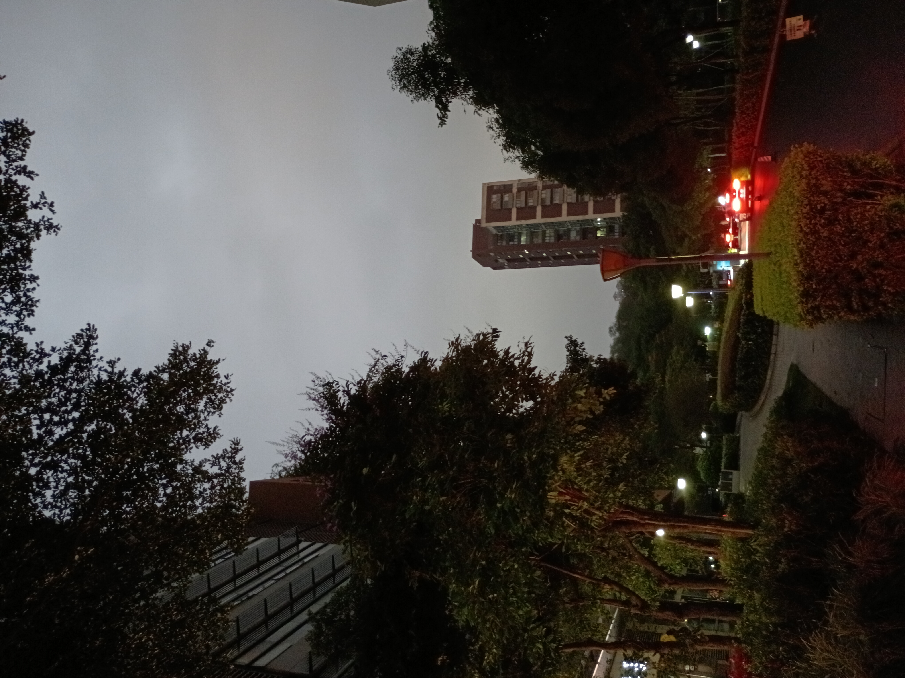
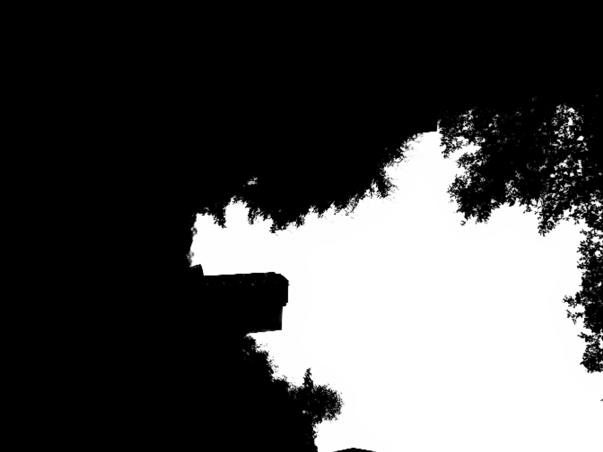
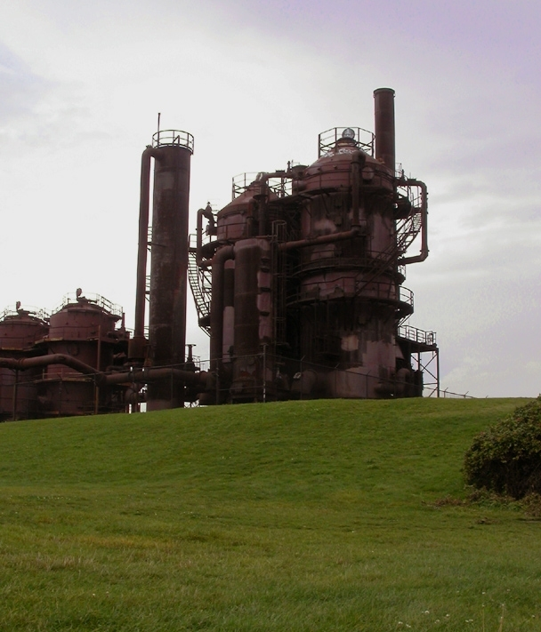

### 1. 人像和天空Matting分割
业务需求是对图像中人像，天空进行分割，由于数据的原因采用两个matting模型（Modnet）分别对人像和天空进行分割。

### 2. 代码结构     

* `cmake`文件夹包含第三方库cmake配置
* `data`包含人像和天空的测试数据和测试结果
* `model`包含人像、天空的不同尺寸的MNN模型

* `modnet`为推理的源码   
* `test`包含测试模型推理效果的代码
* `thirdParty`包含地方的头文件和库目录

### 3. 模型推理     

人像和天空模型都拥有三个尺寸（height, width）`384_512`, `512_512`, `512_672`, 可以根据业务实际需求进行选择，  人像和天空的模型网络结构完全一致，因此两个模型推理的时候可以进行内存复用，模型采用MNN进行推理（windows编译）。
以下是人像、天空的推理的效果图（推理模型尺寸`512_672`）：

|           原图           |             alpha              |
| :----------------------: | :----------------------------: |
|  |  |
|     |     |
|     |     |


### 4. 编译运行
```
cmake -B build        
cmake --build build --parallel 12      
./build/test/test       

```